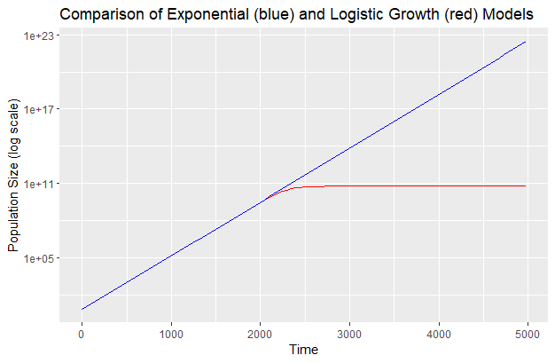

# Question 1:

We are estimating initial population size (N0), growth rate (r) and carrying capacity (K) of 100µl E.coli in a 900µl growth media in a test tube, totalling a volume of 1ml. 

When bacteria initially begin to grow, we expect rapid multiplication due to an abundance of resources. But, as resources are used and are more scarce the growth rate should decrease. This should result in a constant population size (K).

To model population growth in this system, we use logistic growth equations. These equations consider the current population size, growth rate and carrying capacity. This model accounts for a decrease in growth rate as carrying capacity is reached, leading to a constant population size (stationary phase) after the exponential growth of the population has occurred (exponential / growth phase). 

In R, we model this with simply plotting the number of bacteria against time on a scatter graph using ggplot2, and then log-transform the y-axis. We then use a linear approximation model to estimate the model parameters of N0, r and K with the growth and stationary phases. To check if we get reasonabily accurate N0, r and K values, we then plot the linear approximation model against the actual results curve. If they somewhat match in shape, then we can be sure that these estimations of N0, r and K are accurate.

For the linear approximation results, using "experiment1.csv" I got:

## Model 1 - the growth phase (K>N0):

| Coefficient | Estimate    | Std. Error | t value | Pr(>|t|) |

|-------------|-------------|------------|---------|----------|

| Intercept   | 6.903e+00   | 1.249e-02  | 552.6   | <2e-16   |

| t           | 9.990e-03   | 1.374e-05  | 727.1   | <2e-16   |

The intercept estimate means N (y-axis) when t=0, the initial population size. Therefore N0 = 6.903e+00.
The t estimate means the increase in N (y-axis) per timestep (1s), which is r (growth rate), therefore r = 9.990e-03.

## Model 2 - the stationary phase (N(t) = K):

| Coefficient | Estimate  | Std. Error | t value | Pr(>|t|)   |

|-------------|-----------|------------|---------|------------|

| Intercept   | 5.979e+10 | 1.084e+08  | 551.4   | <2e-16 *** |

The intercept estimate means the carrying capacity (K), therefore K = 5.979e+10.

# Question 2:

At t=4980 and using the formula N(t) = N0 x e^rt that assumes exponential growth and no carrying capacity, I found that the population size is 2.787887e+22 (N(t)). When I found the population size at t=4980 in the logistic growth model, N = 5.979e+10 (which is actually the estimated carrying capacity). This is lower compared to the constant exponential growth model. This makes sense as the carrying capcity in the logisitic model is hit after around 2000 minutes. The other model does not have a carrying capacity in its equation, and so does not slow down as it nears carrying capacity unlike the logistic model. (Code for how this was done is in the repository as "Question2and3").

# Question 3:

 

(Code for how this was done is in the repository as "Question2and3").

